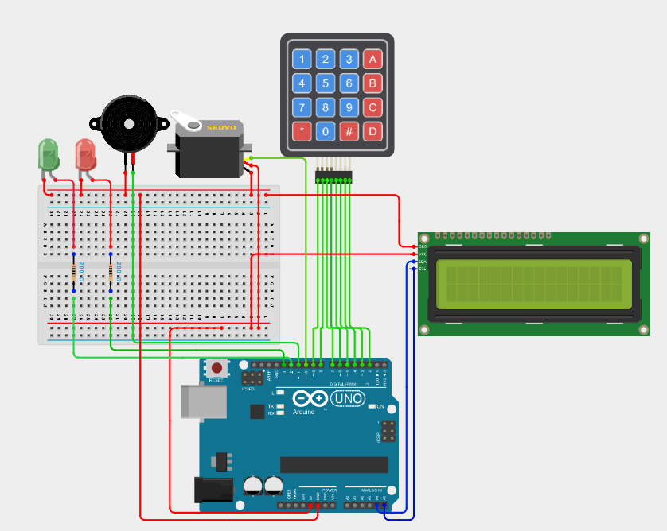
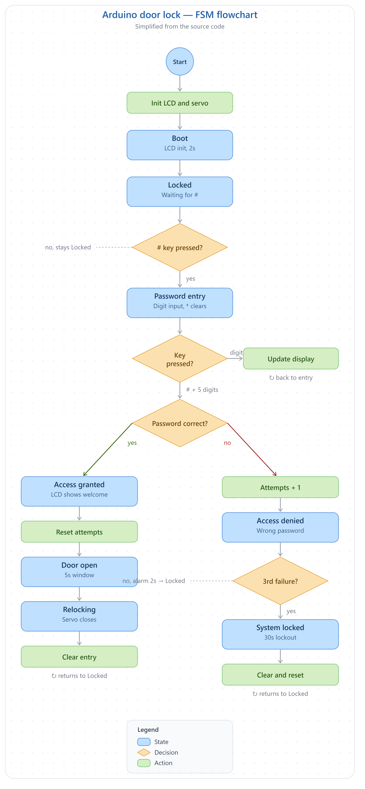

# 🔐 Password Secured Door Lock System (Version 2)

## Overview

The **IoT Smart Door Lock System** is an ESP32-based embedded security project that combines **password-based access control, IoT communication, remote monitoring, and remote control**.

The system uses a **4×4 matrix keypad** for local password authentication and a **0.96" OLED display** for user feedback. The control logic is implemented using a **Finite State Machine (FSM)** architecture.

The ESP32 connects to Wi-Fi and communicates with a **Telegram Bot**, allowing the administrator to receive security notifications and remotely monitor and control the lock.

During the current development stage, the physical servo motor is not installed. The **green LED is used as a temporary representation of the unlocked state**. The servo interface is retained in the design for future hardware integration.

The project demonstrates the integration of **Embedded Systems, IoT, FSM-based control, wireless communication, and remote security management**.

---

# ✨ Features

## Embedded Features

- ESP32-based Smart Door Lock
- Finite State Machine (FSM) architecture
- Password-protected access control
- 4×4 Matrix Keypad interface
- Five-digit password authentication
- Password masking using `*`
- Password reset during entry using `*`
- 0.96" OLED display interface
- Green LED indication for successful authentication
- Red LED indication for failed authentication
- Buzzer alert for incorrect password attempts
- Three-attempt security lockout
- Temporary 30-second system lock
- Automatic return to locked state
- Non-blocking state transitions using `millis()`
  
---

## IoT Features

- ESP32 Wi-Fi connectivity
- Telegram Bot integration
- Startup notification
- Successful authentication notification
- Incorrect password notification
- Security lockout notification
- Telegram command to control the lock remotely
- Telegram user authorization using Chat ID

---

## 📱 Telegram Commands

The administrator can remotely interact with the smart lock using Telegram.

| Command | Function |
|---------|----------|
| `/start` | Start the Smart Lock Bot |
| `/help` | Display available commands |
| `/status` | Display current lock and system status |
| `/unlock` | Remotely unlock the door |
| `/lock` | Remotely lock the door |

---

# 🛠 Components Used

| Component | Quantity |
|-----------|:--------:|
| ESP32 NodeMCU-32S | 1 |
| 4×4 Matrix Keypad | 1 |
| 0.96" OLED Display (SSD1306 I2C) | 1 |
| SG90 Servo Motor *(Development currently uses Green LED)* | 1 |
| Active Buzzer | 1 |
| Green LED | 1 |
| Red LED | 1 |
| 220Ω Resistors | 2 |
| Breadboard | 1 |
| Jumper Wires | As required |

---

# 📌 Pin Configuration

| ESP32 GPIO | Connected Device |
|------------|------------------|
| GPIO12 | Keypad Row 1 |
| GPIO14 | Keypad Row 2 |
| GPIO27 | Keypad Row 3 |
| GPIO26 | Keypad Row 4 |
| GPIO25 | Keypad Column 1 |
| GPIO33 | Keypad Column 2 |
| GPIO32 | Keypad Column 3 |
| GPIO13 | Keypad Column 4 |
| GPIO23 | Green LED |
| GPIO19 | Red LED |
| GPIO18 | Buzzer |
| GPIO5 | Servo Motor *(Future Hardware)* |
| GPIO21 | OLED SDA |
| GPIO22 | OLED SCL |

---

# ⚙️ Working Principle

1.The ESP32 initializes the keypad, OLED, LEDs, buzzer, and Wi-Fi.
2.The user presses # and enters the password using the 4×4 keypad.
3.The password is displayed as * on the OLED and then verified.
4.If the password is correct, the green LED turns ON and the system enters the unlock state.
5.If the password is wrong, the red LED and buzzer are activated, and the failed-attempt count increases.
6.After three wrong attempts, the system enters a 30-second lockout.
7.The ESP32 sends important security events to the administrator through Telegram.
8.The authorized administrator can also use Telegram commands such as /status, /unlock, and /lock to monitor and control the system remotely.
9.The FSM controls all these states and automatically returns the system to the locked state after the required timeout.

---

<!-- # 🔌 Circuit Diagram

---
-->

# 🔄 Flowchart

---

# 🚀 Future Versions

## Version 4 — AI Smart Security

- ESP32-CAM Integration
- Face Recognition
- Image Capture on Unauthorized Access
- Send Captured Image via Telegram
- Cloud Event Logging
- Dual Authentication (Face + Password)
- Visitor Recognition
- AI-based Intrusion Detection

---

# 📈 Version Status

| Version | Description | Status |
|----------|-------------|:------:|
| Version 1 | Arduino-based Password Door Lock | ✅ Completed |
| Version 2 | ESP32 IoT Smart Door Lock with Telegram Notifications | ✅ Completed |
| Version 3 | Remote Monitoring & Telegram Commands | ✅ Completed|
| Version 4 | AI Face Recognition Security | 🔜 Planned |

